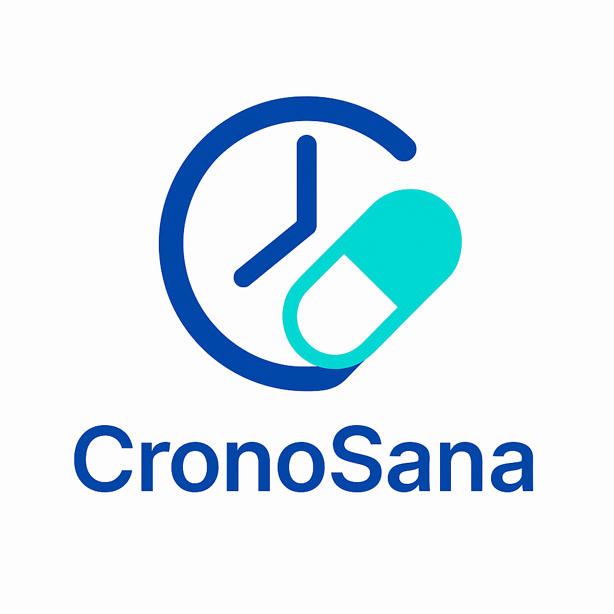
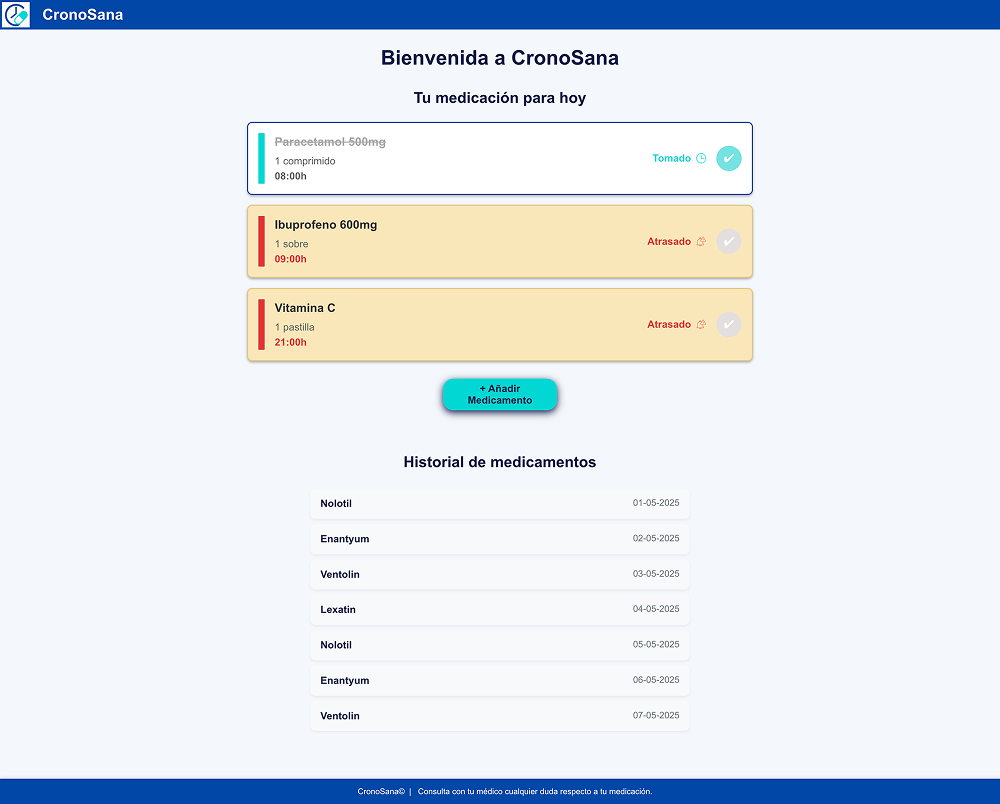
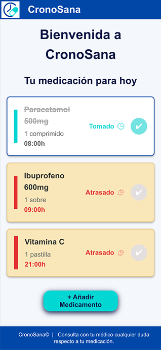
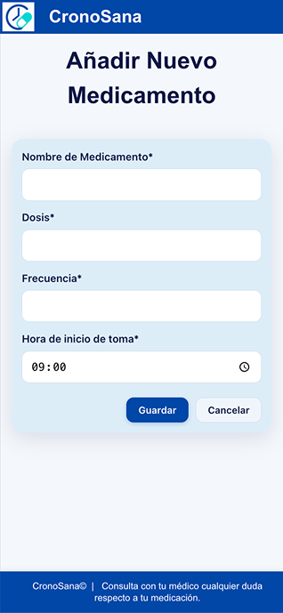

# CronoSana - Recordatorio de Medicamentos

 
## 🚀 Acerca del Proyecto

**CronoSana** es una aplicación diseñada para simplificar la gestión y el recordatorio de la toma de medicamentos.

Nuestro objetivo es ofrecer una herramienta fiable y fácil de usar que aporte tranquilidad a los usuarios y les permita seguir sus pautas de medicación de forma consistente.

## ✨ Características Principales

Actualmente, CronoSana ofrece las siguientes funcionalidades:

* **Lista de Medicamentos Diaria:** Visualiza claramente todos los medicamentos programados para el día.
* **Marcado Rápido de Dosis:** Marca fácilmente los medicamentos como "Tomados" con un solo clic.
* **Alertas Visuales:** Identifica rápidamente las dosis "Atrasadas" (que ya deberían haberse tomado) con indicadores visuales claros.
* **Estado de Medicación:** Consulta el estado actual de cada medicamento (Pendiente, Tomado, Atrasado) con iconos y texto descriptivo.

### 🎯 Funcionalidades Futuras (MVP y Siguientes Iteraciones)

Estamos planificando las siguientes mejoras:

* **Añadir Nuevos Medicamentos:** Funcionalidad completa para que los usuarios puedan programar nuevas medicaciones.
* **Gestión de Historial:** Acceso a un historial de tomas y un calendario de medicación.
* **Notificaciones:** Implementación de notificaciones push o locales para recordar la toma de medicamentos.

## 🛠️ Tecnologías Utilizadas

Este proyecto frontend ha sido desarrollado con las siguientes tecnologías:

* **React 19:** Biblioteca JavaScript para construir interfaces de usuario.
* **Vite:** Herramienta de construcción rápida para proyectos web modernos.
* **React Router DOM 6:** Para la navegación y el manejo de rutas en la aplicación.
* **CSS Puro:** Estilos personalizados para el diseño y la responsividad de la interfaz.
* **Axios:** Cliente HTTP para realizar peticiones a APIs externas (backend).

## 📦 Estructura del Proyecto

La estructura de carpetas sigue una organización modular para facilitar el desarrollo y mantenimiento:
```
├── public/                 // Archivos estáticos
├── src/
│   ├── assets/             // Recursos como imágenes e iconos
│   │   ├── img/
│   │   │   ├── fav_logo.png
│   │   │   ├── icon_alert.png
│   │   │   └── icon_clock.png
│   │   └── logo.svg
│   ├── components/         // Componentes reutilizables de UI
│   │   ├── AddMedicationButton.jsx
│   │   ├── Button/
│   │   │   ├── Button.css
│   │   │   └── Button.jsx
│   │   ├── Footer.jsx
│   │   ├── FormMedi/
│   │   │   ├── Form.css
│   │   │   └── Form.jsx
│   │   ├── Historial.jsx
│   │   ├── MedicationCard.jsx
│   │   ├── MedicationList.jsx
│   │   ├── Navbar.jsx
│   │   └── PreviousList.jsx
│   ├── pages/              // Componentes de página (vistas principales)
│   │   ├── AddPage.jsx
│   │   └── HomePage.jsx
│   ├── services/           // Módulos para interactuar con APIs externas
│   │   └── medicationService.js
│   ├── styles/             // Archivos CSS específicos de componentes o globales
│   │   └── MedicationCard.css
│   ├── App.css
│   ├── App.jsx
│   ├── index.css
│   └── main.jsx            // Punto de entrada de la aplicación
├── .gitignore
├── index.html
├── package.json
├── README.md
├── vite.config.js
└── package-lock.json
```

## ⚙️ Instalación y Ejecución

Sigue estos pasos para poner en marcha el proyecto en tu entorno local:

1.  **Clona el repositorio:**
    ```bash
    git clone https://github.com/Equipo-4-Hackaton-F5/CronoSana-Front.git
    cd cronosana-front
    ```

2.  **Instala las dependencias:**
    ```bash
    npm install
    # o si usas yarn:
    # yarn install
    ```

3.  **Ejecuta la aplicación en modo desarrollo:**
    ```bash
    npm run dev
    # o si usas yarn:
    # yarn dev
    ```

4.  **Compila la aplicación para producción:**
    ```bash
    npm run build
    # o si usas yarn:
    # yarn build
    ```

## 📸 Capturas de Pantalla

Aquí puedes ver la interfaz en versión Desktop y Mobile:

### Desktop



### Mobile


